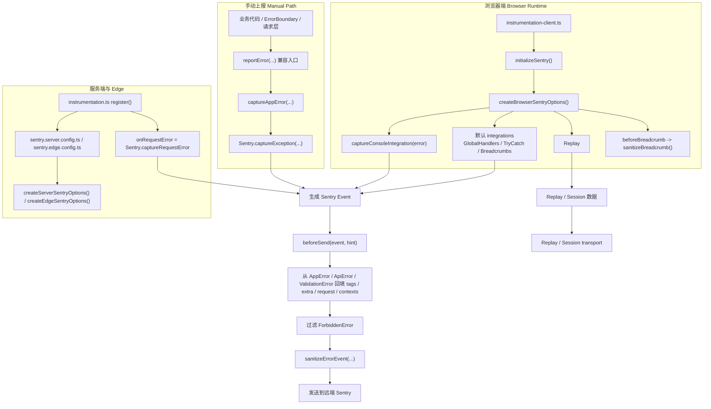

# Sentry 指引

## 目标

- `src/libs/observability/sentry` 是当前项目已经接管的集中式 Sentry 实现。

- 这份指引的目标是把当前运行结构、设计原则、上报入口和调试方式收拢到一个文档里。

## 当前生效入口

- 最终手动上报入口：
  - `src/libs/observability/sentry/report.ts`
- `captureAppError()` 是当前真正的手动上报发送入口。

- 最终自动处理入口：
  - `src/libs/observability/sentry/options.ts`
- `beforeSend()` 是自动事件最终增强、过滤、清洗的统一入口。

- 浏览器运行时入口：
  - `src/libs/observability/sentry/browser.ts`
- 浏览器专属初始化、Replay、console capture 和路由切换埋点都放在这里。

- Legacy 兼容入口：
  - `src/utils/error.ts`
- 仓库里原有的 `reportError()` 调用仍然保留，但内部已经统一转发到 `captureAppError()`。

## 现有上报流程（总览）

- 自动上报主链路：
  - 浏览器默认异常捕获（未处理异常、未处理 Promise rejection）
  - `global-error.tsx` 致命 UI 兜底
  - 统一进入 `beforeSend(...)` 清洗与过滤

- 手动上报主链路：
  - 业务代码调用 `reportError(error, options?)`
  - 转发到 `captureAppError(...)`
  - 调用 `Sentry.captureException(...)`
  - 最终仍会进入 `beforeSend(...)`

- 团队约定：
  - 需要手动上报的地方，统一调用 `reportError(...)`
  - 不直接在业务侧调用 `Sentry.captureException(...)`

## 当前目录结构

```text
src/libs/observability/sentry/
├── browser.ts
├── index.ts
├── options.ts
├── sanitize.ts
├── report.ts
└── errors.ts
```

## Next.js 约定入口文件

### `src/instrumentation-client.ts`

- 这是 Next.js 的客户端约定入口文件，不需要在业务代码里显式引用。
- Next.js 会在浏览器端自动加载它。

- 当前职责：
  - 调用 `initializeSentry()`
  - 导出 `onRouterTransitionStart`

- 作用：
  - 作为浏览器端 Sentry 初始化入口
  - 作为客户端路由切换埋点入口

### `src/instrumentation.ts`

- 这是 Next.js 的服务端约定入口文件，同样不需要业务代码显式引用。
- Next.js 会在 server / edge runtime 启动时自动执行它。

- 当前职责：
  - development + mock 开关开启时初始化 MSW server mocking
  - 在 `nodejs` runtime 下动态加载 `sentry.server.config.ts`
  - 在 `edge` runtime 下动态加载 `sentry.edge.config.ts`
  - 导出 `onRequestError = Sentry.captureRequestError`

- 作用：
  - 作为服务端与 edge 端的 Sentry 初始化入口
  - 作为 request 级错误捕获入口

## 环境开关

- 当前默认行为：
  - `NODE_ENV === 'production'` 时启用完整 Sentry 链路
  - `NEXT_PUBLIC_APP_ENV === 'test'` 时也启用完整 Sentry 链路
  - 其他开发环境默认关闭
- 可以显式打开 dev 下的 Sentry：
  - `NEXT_PUBLIC_ENABLE_SENTRY_IN_DEV=true`
  - 作用：
    - 允许开发环境初始化浏览器/服务端 Sentry SDK
    - 允许 `withSentryConfig(...)` 在非 production 场景下也接入插件链路

## 测试页入口

- 当前项目提供了一个专门的 Sentry 测试页：
  - `src/app/[locale]/test/sentry/page.tsx`
  - `src/app/[locale]/test/sentry/_components/sentry-debug-panel.tsx`

- 访问路径：
  - `/{locale}/test/sentry`
  - 例如：
    - `/pt/test/sentry`
    - `/es/test/sentry`
    - `/en/test/sentry`

- 这页的用途：
  - 验证自动捕获链路是否正常
  - 验证 `reportError(...)` / `captureAppError(...)` 是否正常
  - 验证请求类错误是否带上 `query / body / response`
  - 验证过滤规则是否符合预期
  - 验证测试环境与正式环境的 Sentry 行为是否一致

- 当前测试页覆盖的错误类型：
  - 全局自动捕获与基础链路
    - 手动调用 `reportError`
    - 仅触发 `console.error`
    - 未捕获异常
    - 未处理 Promise 拒绝
    - 未登录态 anonymous 上报
  - 应用错误类型与业务异常
    - `AppError`
    - `RuntimeError`
    - Session 初始化失败
    - `StoreSyncError`
  - 请求类错误
    - 接口错误 `500`
    - 业务码 `700`
    - 接口限流 `429`
    - 仅 `searchParams` 请求错误
    - 网络错误 `503`
    - 空响应体错误
    - 非法 JSON 响应
    - 响应格式错误（缺少 `code`）
    - 数据校验错误
    - 模拟 schema 校验失败（不中断业务）
  - 按策略会被过滤的错误
    - `AbortError`
    - 普通 `ForbiddenError`
    - 鉴权过期 `1000`
    - 鉴权过期 `1001`
  - 实时链路与状态恢复
    - WebSocket 解析错误
    - WebSocket 重连失败
    - 恢复校验错误
    - SSE / 实时流错误

- 使用建议：
  - 想验证“是否真的进入 Sentry”时，优先点：
    - 未捕获异常
    - 未处理 Promise 拒绝
    - 接口错误 `500`
    - 非法 JSON 响应
  - 想验证“是否按策略过滤”时，点：
    - `AbortError`
    - 权限拒绝错误（会过滤）
    - 鉴权过期 `1000/1001`
  - 想验证请求上下文字段时，点：
    - 接口错误 `500`
    - 仅 `searchParams` 请求错误
    - 空响应体错误
    - 非法 JSON 响应
    - 响应格式错误（缺少 `code`）

## 文件职责

### `src/libs/observability/sentry/browser.ts`

- 浏览器专属的运行时入口和 integration 配置层。

- 主要职责：
- 初始化浏览器端 Sentry
- 组合浏览器专属 integrations
- 导出路由切换埋点能力

- 主要导出：
  - `createBrowserSentryOptions()`
  - `initializeSentry()`
  - `onRouterTransitionStart`

  - `createBrowserSentryOptions()` 负责构造浏览器专属 Sentry 配置，包括 Replay、`CaptureConsole`、`beforeBreadcrumb` 和 replay 采样。
  - `initializeSentry()` 封装了 `Sentry.init(...)`，并在开发环境下防止浏览器端重复初始化。
  - `onRouterTransitionStart` 从 Sentry 重新导出，用于把 Next 路由切换接入浏览器端上下文。

### `src/libs/observability/sentry/index.ts`

- 共享的非浏览器 Sentry 能力统一聚合出口。

- 主要职责：
- 重新导出共享 runtime options
- 重新导出上报 API
- 重新导出错误模型和用户上下文工具

### `src/libs/observability/sentry/options.ts`

- server/edge 共享的 runtime options，以及统一的 `beforeSend()` 策略。

- 主要职责：
- 共享启用开关、environment、release 配置
- server/edge options 构造器
  - `beforeSend`

- 主要导出：
  - `beforeSend(event, hint)`
  - `createBaseOptions()`
  - `createServerSentryOptions()`
  - `createEdgeSentryOptions()`

- 
  - `beforeSend(event, hint)` 是最重要的自动链路钩子。它会从应用错误上下文补充 event、过滤 `ForbiddenError`、执行最终清洗，再交给正式 transport 发送。
  - `createBaseOptions()` 负责构造非浏览器 runtime 共用的基础配置。
  - `createServerSentryOptions()` 和 `createEdgeSentryOptions()` 则把这份基础配置包装成实际 runtime 初始化用的配置。

### `src/libs/observability/sentry/sanitize.ts`

- 统一清洗和过滤层。

- 主要职责：
- 敏感字段脱敏
- URL/tag/context 清洗
- 浏览器噪声过滤
- hydration-extension 噪声过滤
- 集中式 breadcrumb 过滤与 payload 收缩

- Breadcrumb rules currently drop:
- websocket console 噪声
  - low-signal `console.log/info/debug`
- TanStack warning breadcrumb
- Next.js 开发态 `metadataBase` warning
- hydration mismatch console 大段输出
- 成功请求的 fetch breadcrumb

- 当前为什么保留这些过滤规则：
  - breadcrumb 上限当前只有 `20`
  - 如果不提前过滤高频低价值日志，很容易把真正有排查价值的上下文挤掉
  - 这些规则的目标不是“少抓错误”，而是“把有限的 breadcrumb 空间留给真正重要的轨迹”

- 逐条判断：
  - `ws-console-noise`
    - 建议保留
    - websocket 日志量通常很大，最容易快速刷满 breadcrumb
  - `low-signal-console`
    - 建议保留
    - `console.log / info / debug` 信号密度低，保留价值有限
  - `tanstack-warning`
    - 建议保留
    - TanStack warning 往往重复且冗长，容易压过真正错误上下文
  - `next-metadata-warning`
    - 建议保留
    - 这是典型开发环境 warning，对线上错误排查价值很低
  - `hydration-mismatch-console`
    - 默认建议保留
    - 这类输出很长，而且本地经常会混入扩展注入噪声
    - 如果未来要专项排查 SSR/hydration 问题，可以临时放开
  - `successful-fetch`
    - 建议保留
    - 成功请求数量通常远多于失败请求，如果全部保留，会显著挤压真正关键的 breadcrumb 空间

- 主要导出：
  - `sanitizeUrl(value)`
  - `sanitizeForSentry(value, currentKey?, depth?, seen?)`
  - `sanitizeTags(tags)`
  - `sanitizeBreadcrumb(breadcrumb)`
  - `sanitizeErrorEvent(event)`

- 
  - `sanitizeUrl(value)` 会保留 path，并保留普通 query 参数值；只有命中敏感 key 的参数才会被打成 `[REDACTED]`。
  - `sanitizeForSentry(...)` 用于递归清洗任意值，主要服务于 `extra`、`contexts`、request data 和嵌套错误对象。
  - `sanitizeTags(tags)` 会对 tag 值应用字段级脱敏规则。
  - `sanitizeBreadcrumb(breadcrumb)` 会先执行集中式 breadcrumb 过滤规则，再对保留下来的 breadcrumb 做清洗。
  - `sanitizeErrorEvent(event)` 是最终 event 清洗器。它会移除浏览器噪声事件、把用户信息收敛成 `user.id`、去掉 request headers/cookies/query_string，并清洗嵌套字段。

### `src/libs/observability/sentry/report.ts`

- 最终手动上报发送入口。

- 主要职责：
- 重复上报去重
- 补充本地 scope 信息
  - call `Sentry.captureException`
- 暴露尽量小的公共 API

- Final public function:
  - `captureAppError(error, options?)`

- 主要导出：
  - `captureAppError(error, options?)`
  - `captureApiError(error)`
  - `captureValidationError(error)`
  - `captureWebSocketError(error)`
  - `captureStoreSyncError(error)`
  - `captureRuntimeError(error, options?)`
  - `captureUiError(error, options?)`

- 
  - `captureAppError(...)` 是唯一的手动发送入口。它会对同一个错误对象做去重，把 `level/tags/extra` 注入临时 Sentry scope，最后调用 `Sentry.captureException(...)`。
  - 这些语义化 wrapper 只是给业务侧提供更好读的调用方式，并不会改变底层发送行为。

## 当前现有上报信息传递结构

### 1. 主要有两层参数载体

当前项目里，显式上报时常见的信息主要放在两层：

- `error.options`
- `error.context`

可以先粗略理解成：

- `options`
  - 放通用上报参数
- `context`
  - 放结构化请求/业务上下文

### 2. `error.options` 里现在放什么

定义位置：

- [src/libs/observability/sentry/errors.ts](/Users/liboya/Documents/work/gtb-works/match-pc/src/libs/observability/sentry/errors.ts:10)

当前 `AppErrorOptions` 只有三个字段：

- `level?: 'fatal' | 'error' | 'warning' | 'info' | 'debug'`
- `tags?: Record<string, string>`
- `extra?: Record<string, unknown>`

典型来源有两种：

- 业务侧调用 `reportError(error, { level, tags, extra })` 时直接传入
- typed error 在构造时内部补进去
  - 例如 `ApiError`
  - `ValidationError`

这意味着：

- 如果只是想给一次错误补等级、标签、调试附加信息
  - 目前主要就是写到 `options`

可以把它理解成一份“通用上报参数”：

- `level`
  - 这次错误的严重级别
- `tags`
  - 用于筛选和聚合的短字段，例如 `module`、`method`、`status`
- `extra`
  - 更详细的调试附加信息，不要求是短字符串

### 3. `error.context` 里现在放什么

`context` 主要出现在 typed error 上，尤其是请求类错误。

最典型的是：

- `ApiError.context`
- `ValidationError.context`

例如 `ApiErrorContext` 当前会放：

- `url: string`
- `method: string`
- `status?: number`
- `statusText?: string`
- `code?: number`
- `traceId?: string`
- `query?: unknown`
- `body?: unknown`
- `response?: unknown`

`ValidationError` 也有一份自己的结构化 `context`：

- `label: string`
- `errors: unknown`
- `data: unknown`

所以从职责上看：

- `options`
  - 偏“上报附加参数”
- `context`
  - 偏“错误本身的结构化上下文”

### 4. `reportError(...)` 和 `captureAppError(...)` 在做什么

业务侧大多数调用还是：

- `reportError(error, options?)`

但它内部只是兼容壳，最终会走到：

- `captureAppError(error, options?)`

当前 `captureAppError(...)` 的行为很简单：

- 如果 `error` 本身带有 `options`
  - 优先用 `error.options`
- 如果业务调用时额外传了 `options`
  - 对非 typed error 场景直接拿来写 scope
- 最终把：
  - `level`
  - `tags`
  - `extra`
  写进临时 Sentry scope
- 然后调用 `Sentry.captureException(...)`

所以当前显式上报的参数传递顺序大致是：

```text
业务调用 reportError(error, options?)
-> captureAppError(...)
-> 从 error.options 或调用参数里读取 level/tags/extra
-> 写入 scope
-> Sentry.captureException(error)
```

### 5. `beforeSend(...)` 里怎么接住这些信息

真正发出前，`beforeSend(...)` 会再统一读取：

- `error.options`
- `error.context`

然后映射到标准 Sentry event。

当前映射关系可以概括成：

- `error.options.level`
  - -> `event.level`
- `error.options.tags`
  - -> `event.tags`
- `error.options.extra`
  - -> `event.extra`
- `error.context`
  - -> `event.request`
  - -> `event.contexts.response`
  - -> `event.contexts.request_payload`

所以现在的完整流转更接近：

```text
业务调用
-> error.options / error.context
-> captureAppError(...)
-> scope level/tags/extra
-> Sentry.captureException(...)
-> beforeSend(...)
-> event.level / event.tags / event.extra / event.request / event.contexts
-> 发送到 Sentry
```

### 6. 当前最常见的参数应该放哪

按现在的实现，推荐这样理解：

- `level`
  - 放 `options.level`
- `tags`
  - 放 `options.tags`
- `extra`
  - 放 `options.extra`
- 请求信息
  - 放 `ApiError.context`
- 响应信息
  - 放 `ApiError.context.response`
- query/body
  - 放 `ApiError.context.query` / `ApiError.context.body`
- schema 校验标签
  - 放 `ValidationError.context.label`
- schema 校验详情
  - 放 `ValidationError.context.errors` / `ValidationError.context.data`

一句话总结就是：

- **现在项目里简单的上报附加参数主要放 `error.options`，结构化请求/业务上下文主要放 `error.context`，最终由 `beforeSend(...)` 翻译成标准 Sentry event。**

### 7. `reportError(...)` 什么时候直接传 `Error`，什么时候 `new XxxError(...)`

- 当前 `reportError(...)` 的真实签名是：

```ts
reportError(error, options?)
```

- 不是：

```ts
reportError(message, options?)
```

- 所以如果你只有一段错误文案，至少也要先变成 `Error` 对象：

```ts
reportError(new Error('something failed'), {
  level: 'error',
  tags: { module: 'wallet', action: 'sync' },
});
```

#### 最推荐的判断方式

- 普通 `catch` 场景
  - 如果只是想补 `level / tags / extra`
  - 直接：

```ts
reportError(error instanceof Error ? error : new Error('fallback message'), {
  level: 'error',
  tags: { module: 'wallet', action: 'sync' },
});
```

- 有明确语义的错误
  - 如果你希望这次错误进入 typed error 的统一结构化链路
  - 再用：

```ts
reportError(new RuntimeError('session initialize failed', {
  tags: { module: 'session-store', action: 'initialize' },
}));
```

#### 当前哪些错误类型需要 `context`

- 只有两类 typed error 真的需要结构化 `context`：
  - `ApiError` / `NetworkError` / `ForbiddenError`
    - 第二个参数是 `ApiErrorContext`
  - `ValidationError`
    - 第二个参数是 `ValidationErrorContext`

- 其他这些不需要 `context`，只需要 `message + options`：
  - `AppError`
  - `RuntimeError`
  - `WebSocketError`
  - `StoreSyncError`

#### `context` 主要是拿来传什么的

- 当前这套里，`context` 的职责不是“随便塞更多参数”，而是：
  - 给 typed error 传结构化错误上下文

- 也就是说，`context` 主要承载两类信息：
  - 请求/响应结构
  - 校验失败结构

- 请求类错误的 `ApiErrorContext` 主要传：
  - `url`
  - `method`
  - `status`
  - `statusText`
  - `code`
  - `traceId`
  - `query`
  - `body`
  - `response`

- 这些字段的用途可以概括成：
  - 请求地址和方法
  - HTTP / 业务错误状态
  - 请求参数或请求体
  - 响应体或响应类调试上下文

- 校验类错误的 `ValidationErrorContext` 主要传：
  - `label`
  - `errors`
  - `data`

- 这些字段的用途可以概括成：
  - 这次校验来自哪里
  - 具体校验错误是什么
  - 原始非法数据是什么

- 如果只是：
  - `module`
  - `action`
  - `step`
  - `trigger`
  - 一次性调试补充信息
  - 这类更适合放在 `tags / extra`
  - 不建议塞进 `context`

- 具体字段清单可以直接看后面的：
  - `src/libs/observability/sentry/errors.ts`
  - 那一节会集中列出 `ApiErrorContext` 和 `ValidationErrorContext` 的真实字段定义

#### 最推荐的团队约定

- 普通运行时错误：
  - `reportError(error, options)`
- 请求类 / 校验类 / 基础设施类错误：
  - `reportError(new XxxError(...))`

- 一句话说：
  - 不是必须每次都 `new AppError`
  - 但必须传 `Error`
  - 简单场景直接传 `Error + options`
  - 语义明确的场景优先 `new RuntimeError / NetworkError / ValidationError / WebSocketError / StoreSyncError`

### `src/libs/observability/sentry/report.ts`

- Sentry 手动上报入口，同时也承载用户上下文同步能力。

- 主要职责：
  - `captureAppError`
  - `syncSentryUserContext`
  - 设置 `user.id`
  - 维护 `auth_state`

- 主要导出：
  - `CaptureAppErrorOptions`
  - `captureAppError(error, options?)`
  - `SentryUserContext`
  - `syncSentryUserContext(user?)`

- 
  - `SentryUserContext` 刻意保持得很小，目前只包含 `uid`。
  - `syncSentryUserContext(user?)` 会把当前用户身份写入 Sentry scope，包括设置 `user.id` 和 `auth_state` tag。
  - 这部分能力现在已经合并进 `report.ts`，不再保留独立的 `user-context.ts` 文件。

### `src/modules/home/_components/sentry-user-context-sync.tsx`

- React 桥接组件，负责把 session store 同步到 Sentry。

- 主要职责：
  - 订阅 `useUser()`
  - 在 `uid` 变化时调用 `syncSentryUserContext(...)`
  - 作为 `AppInitializer` 的一部分挂载

- 说明：
  - 这个组件本质上是 app wiring，而不是 Sentry core library。
  - 放在 `modules/home/_components` 更符合“应用初始化桥接层”的职责边界。

### `src/libs/observability/sentry/errors.ts`

- 统一错误模型和错误工厂层。

- 主要职责：
- 定义稳定的应用错误类型
- 集中组装 tags/extra/context
- 提供语义化错误工厂函数

- Core shared types:
  - `ErrorLevel`
  - `AppErrorOptions`
  - `ApiErrorContext`
  - `ValidationErrorContext`

- 
  - `ErrorLevel` 是手动上报和自定义错误类共用的错误等级类型，当前可选值是 `fatal | error | warning | info | debug`。
  - `AppErrorOptions` 是挂在应用错误上的通用扩展参数，目前支持：
    - `level`：Sentry 等级覆盖
    - `extra`：任意结构化补充数据
    - `tags`：用于筛选/聚合的短字符串标签
  - `ApiErrorContext` 是网络类错误使用的请求/响应上下文，目前支持：
    - `url`：请求 URL
    - `method`：HTTP 方法
    - `status`：HTTP 状态码
    - `statusText`：HTTP 状态文案
    - `code`：业务错误码
    - `traceId`：链路追踪 ID
    - `query`：清洗后的查询参数
    - `body`：清洗后的请求体
    - `response`：响应体或响应类调试上下文
  - `ValidationErrorContext` 是 schema 校验类错误使用的上下文，目前支持：
    - `label`：稳定的校验来源标识
    - `errors`：结构化校验错误
    - `data`：原始非法 payload

- Error classes:
  - `AppError`
  - `ApiError`
  - `NetworkError`
  - `ForbiddenError`
  - `ValidationError`
  - `RuntimeError`
  - `WebSocketError`
  - `StoreSyncError`

- 
  - `AppError(message, options?)`
    - 应用侧可上报错误的基类
    - 适合没有特殊上下文结构的通用业务/运行时失败
  - `ApiError(message, context, options?)`
    - 标准请求/响应错误
    - 会自动清洗请求 URL、query、body、params 和 response
    - 会自动补充 `url`、`method`、`status`、`code` 等 tag
  - `NetworkError(message, context, options?)`
    - `ApiError` 的特化子类
    - 适用于更偏传输层/网络层失败，而不是业务拒绝
  - `ForbiddenError(message, context, options?)`
    - `ApiError` 的特化子类
    - 适用于预期内的鉴权失败或业务拒绝
    - 默认等级是 `warning`
    - 当前会被 `beforeSend()` 直接过滤掉
  - `ValidationError(message, context, options?)`
    - schema/契约校验失败
    - 会自动清洗 `errors` 和 `data`
    - 会自动补充 `validation_label`
    - 默认等级是 `warning`
  - `RuntimeError(message, options?)`
    - 没有请求上下文的通用运行时/业务流程错误
  - `WebSocketError(message, options?)`
    - 适用于 websocket、流式、实时链路失败
  - `StoreSyncError(message, options?)`
    - 适用于 store rehydrate、持久化、同步链路失败

- Factory helpers:
  - `createApiError(...)`
  - `createNetworkError(...)`
  - `createValidationError(...)`
  - `createRuntimeError(...)`
  - `createWebSocketError(...)`
  - `createStoreSyncError(...)`

- 
  - 这些工厂函数的存在，是为了让业务代码直接创建正确的 typed error，而不必重复写构造细节，也不会漏掉清洗规则。
  - `shouldReportHttpStatus(status)` 是一个小型策略函数，当前主要供 fetcher 使用；它会在 `>= 500` 和 `429` 时返回 `true`。

## 设计原则

- Keep only two core entrypoint concepts:
  - `beforeSend`
  - `captureAppError`

- Separate responsibilities clearly:
- payload 清洗
- runtime 配置
- 手动上报
- 用户上下文同步
- 错误建模

- Do not let business code assemble Sentry payload shape directly.
- 业务代码不应该自己拼装 Sentry 的 payload 细节。

## 浏览器 Integration 策略

- `captureConsoleIntegration` 和 `thirdPartyErrorFilterIntegration` 解决的是两类不同问题，不能把它们当成互相替代。

- `captureConsoleIntegration`
- 它的作用是扩大采集面，把 `console.error` 这一类控制台错误信号也纳入 Sentry 链路。

- `thirdPartyErrorFilterIntegration`
- 它的作用是收缩噪声，把第三方脚本或注入脚本产生的错误过滤掉。

- 当前策略：
- 当前实现通过 `captureConsoleIntegration({ levels: ['error'] })` 来补充更多高信号客户端错误，同时依赖 `sanitizeErrorEvent()` 统一过滤扩展脚本噪声、钱包注入噪声、websocket console 噪声、`AbortError` 等低价值浏览器事件。

- 当前为什么不直接使用 `thirdPartyErrorFilterIntegration`：
- 当前仓库安装的 `@sentry/nextjs` 版本并没有导出这个 integration，因此当前实现不能直接使用它，否则就需要引入不稳定的运行时兜底逻辑。

## 当前上报来源

### 自动链路

- 最终自动处理入口：
  - `beforeSend`

- 自动捕捉范围：
- 捕捉未处理的浏览器异常
- 捕捉未处理的 Promise rejection
- 捕捉错误边界里的异常
- 捕捉自动进入 SDK 的 request/runtime 错误
- 在启用时捕捉来自 console 的错误信号

### 手动链路

- 最终手动上报入口：
  - `captureAppError`

- 当前主要使用方：
- API/client 代码
- websocket/runtime 代码
- store rehydration/sync 代码
- 模块业务流程代码
- 显式 UI 错误上报

### 当前 `reportError()` 调用点

- `src/utils/error.ts` 目前仍然是旧 `reportError(...)` 的兼容入口。虽然真实发送已经统一走 `captureAppError(...)`，但当前仓库里仍有一部分显式调用点。
- 这些调用点现在可以按“平台边界”和“吞错降级”两类去理解。

#### 一、平台边界上的显式上报

- `src/api/client.ts`
  - 统一 fetcher 层
  - 负责网络失败、HTTP 失败、协议异常、`code=700` 这类请求边界错误

- `src/api/lib/validation.ts`
  - 请求成功后的 schema 校验上报
  - 只在 development 之外真正上报

- `src/api/lib/ssr-fetch.ts`
  - SSR 请求失败
  - `queryWithoutError(...)` 这类“吞错并返回 fallback”的包装层

- `src/app/global-error.tsx`
  - 当前唯一保留的运行时 UI 兜底边界
  - 用于整页级致命错误

- `src/utils/websocket/helper.ts`
  - WebSocket 二进制 payload 文本解码失败

- `src/hooks/use-socket-listener.ts`
  - 事件观察者回调自身抛错

#### 二、吞错降级但监控会丢的显式上报

- `src/modules/bet-slip/stores/internal/lifecycle.ts`
  - store 恢复后的同步失败
  - 本地投注项校验失败
  - 这些错误不会再自然冒泡到全局链路

- `src/modules/bet-slip/stores/slices/sync-slice.ts`
  - 购物车长期锁定时的超时兜底
  - 属于典型“继续运行，但仍然需要监控”的场景

- `src/modules/match/detail/layout.tsx`
  - 比赛详情页请求完成后的 bet-slip 复核失败
  - 这里已经 catch 住错误，不手动上报就会变成静默失败

- `src/modules/match/_hooks/use-odds-change-observer.ts`
  - ws 赔率更新后 `invalidateQueries` 失败
  - 更偏运行时刷新链路异常，而不是请求层异常

### 新增 `reportError(...)` 的判断与示例

#### 什么时候应该新增

- 满足下面任一类情况，才更推荐新增手动上报：
  - 错误已经被 `catch`，不会再自动进入全局异常链路
  - 出错后会继续降级运行、fallback 返回或静默恢复
  - 属于平台边界或核心基础设施
  - 不手动上报就会形成监控盲区

#### 什么时候不建议新增

- 不建议因为“看到 console.error”就顺手补 `reportError(...)`
- 下面这些默认不建议主动补：
  - navigation abort
  - 预期鉴权失效
  - 普通业务失败，例如余额不足、资格不满足、重复提交
  - 纯开发态 warning

#### 推荐写法 1：普通运行时错误

- 适合：
  - 普通 `catch` 场景
  - 只需要补 `level / tags / extra`

```ts
try {
  await doSomething();
} catch (error) {
  reportError(error instanceof Error ? error : new Error('fallback message'), {
    level: 'warning',
    tags: {
      module: 'match-detail',
      action: 'recheck-bet-slip',
      trigger: 'http-merge',
    },
    extra: {
      matchId,
    },
  });
}
```

#### 推荐写法 2：请求类 typed error

- 适合：
  - 你明确知道这是请求/响应层问题
  - 希望带上结构化 `context`

```ts
reportError(
  new NetworkError('SSR fetch failed', {
    url: requestUrl,
    method: 'GET',
    query: { locale },
    response: {
      revalidate,
      originalError: error instanceof Error ? error.message : String(error),
    },
  }),
  {
    tags: {
      module: 'ssr-fetch',
      action: 'fetch-list',
    },
  },
);
```

#### 推荐写法 3：校验类 typed error

- 适合：
  - schema 校验失败
  - 契约不匹配

```ts
reportError(
  new ValidationError('API Validation Failed: match-detail', {
    label: 'match-detail',
    errors: result.error.format(),
    data,
  }),
);
```

#### 最后的一条团队规则

- 优先判断“这次错误如果不手动报，会不会完全丢监控”
- 如果答案是否定的：
  - 不要新增 `reportError(...)`
- 如果答案是肯定的：
  - 再选择 `Error + options`
  - 或 `new XxxError(...)`

### 团队约定：手动上报入口

- 当前团队内统一约定：
  - 需要手动上报时，统一调用 `reportError(...)`
  - 不在业务代码里直接调用 `Sentry.captureException(...)`

- `capture*Error(...)` 这类 helper 仍可作为内部封装能力保留，
  - 但业务层统一入口以 `reportError(...)` 为准，方便检索和治理。

## 上报流程图

- 当前 Sentry 的实际链路可以概括成三条入口：
  - 浏览器自动捕获
  - 业务手动上报
  - server / edge request 级错误

- 它们最终都会汇总到：
  - `beforeSend(...)`
  - `sanitizeErrorEvent(...)`
  - 统一进入远端 Sentry transport



### 流程说明

1. 浏览器端在 `instrumentation-client.ts` 中调用 `initializeSentry()`，建立自动捕获链路。
2. 自动捕获主要来自默认 integrations、`captureConsoleIntegration`、以及浏览器运行时异常。
3. 业务侧显式调用 `reportError(...)` 时，最终会进入 `captureAppError(...)`，再调用 `Sentry.captureException(...)`。
4. server / edge 端通过 `instrumentation.ts` 动态加载 `sentry.server.config.ts` / `sentry.edge.config.ts`，并把 `onRequestError` 接给 Sentry。
5. 不管事件来自自动捕获还是手动上报，只要是普通 error event，最终都会进入 `beforeSend(...)`。
6. `beforeSend(...)` 会做三件核心事情：
   - 从 typed error 回填结构化上下文
   - 过滤 `ForbiddenError`
   - 执行 `sanitizeErrorEvent(...)`
7. 清洗后的事件会按正常 transport 发送到配置好的 Sentry 项目。
8. Replay / session 数据和普通 error event 不是同一条 payload，但仍然共用浏览器初始化配置。

## 请求错误 Payload 结构

- 请求类失败现在会尽量收敛到更明确的结构，方便直接查看 payload。

- 主要字段：
  - `request.url`
  - `request.method`
  - `request.data`
  - `contexts.request_payload.query`
  - `contexts.request_payload.body`
  - `contexts.response`

- `request.data` 现在只承载明确的请求体。

## Network Payload 类型

- 在 DevTools 里看 `/monitoring` 请求时，并不是每一种 payload 都是普通错误事件。

- `type: event`
- 普通 Sentry 错误事件。你主要应该看这类 payload 里的 exception、tags、user、request、extra。

- `type: replay_event`
- Session Replay 的元数据，例如 replay id、关联 error id、页面 URL、release、user 上下文。

- `type: replay_recording`
- 压缩后的 replay 录制数据。正文看起来像乱码是正常的，因为它是二进制/编码后的 rrweb 会话录制内容，不是可读的错误文本。

## Legacy 兼容层

- `src/utils/error.ts`
- 当前仍然保留为兼容 API 入口。

- 这个文件已经不再是主实现中心，可以随着业务调用点逐步迁移到语义化 capture helper 而慢慢退场。

## 后续优化方向

### 可以继续优化的方向

- 继续把 `src/api/client.ts` 的错误分类抽得更清楚
  - 例如把网络失败、HTTP 失败、协议异常、鉴权失效、普通业务失败再做更稳定的 helper 拆分

- 继续把“不上报边界”写死
  - navigation abort
  - 预期鉴权失效
  - 普通业务失败

- 继续把业务层显式上报收敛成更少的几类 helper
  - `captureRuntimeError(...)`
  - `captureApiError(...)`
  - `captureValidationError(...)`
  - `captureWebSocketError(...)`
  - `captureStoreSyncError(...)`

- 继续把 `src/utils/error.ts` 当成兼容入口
  - 等旧 `reportError(...)` 调用点迁得更干净后，可以最终退掉

### 当前继续保留显式上报的地方

- 请求层、协议层、验证层
  - 例如 `src/api/client.ts`、`src/api/lib/validation.ts`
- 全局 UI 致命兜底
  - `src/app/global-error.tsx`
- 已经被 `catch`、不会再自动冒泡、但仍然需要监控的降级链路
  - 例如 store 恢复、fallback、WebSocket 解码和事件观察者回调异常


## 当前 Tag 定义与用途

### Tag 的主要来源

- 当前 Sentry tag 主要来自三类来源：
  - 错误模型自动补充
  - 用户上下文同步时写入
  - 业务调用点手动传入

- 最终所有 tag 都会经过：
  - `src/libs/observability/sentry/sanitize.ts`
  - `sanitizeTags(tags)`

- 作用：
  - 对敏感字段做脱敏
  - 截断过长字符串
  - 统一清洗 URL 类字段

### 一、错误模型自动生成的稳定 Tag

- 这些 tag 主要定义在：
  - `src/libs/observability/sentry/errors.ts`

- `ApiError` / `NetworkError` / `ForbiddenError`
  - 自动生成：
    - `url`
    - `method`
    - `status`
    - `code`
  - 主要用途：
    - 标识接口地址
    - 区分 HTTP 方法
    - 区分 HTTP 状态码或业务状态
    - 按业务错误码筛选

- `ValidationError`
  - 自动生成：
    - `validation_label`
  - 主要用途：
    - 标识是哪一个 schema / 接口校验失败

### 二、运行时同步写入的全局 Tag

- 这些 tag 主要定义在：
  - `src/libs/observability/sentry/report.ts`

- `auth_state`
  - 可选值：
    - `anonymous`
    - `authenticated`
  - 主要用途：
    - 区分报错发生时用户是否已登录

### 三、业务调用点手动传入的 Tag

- 这些 tag 来自各个 `reportError(...)` / `captureAppError(...)` 调用点。
- 目前还没有完全统一成固定 schema，更多是按场景手动补充。

#### 1. `module`

- 最常见的业务 tag，用来标识报错归属模块。
- 典型位置：
  - `event-observer`
  - `ad-placement`
  - `wallet`
  - `ssr-fetch`
  - `match-item-observer`
  - `outright-observer`
  - `match-sidebar`
  - `app-info`
  - `websocket`

- 主要用途：
  - 快速判断错误属于哪个业务域或基础模块

#### 2. `trigger`

- 用来标识“是什么动作/触发路径导致这次上报”。
- 典型值：
  - `visibilitychange`
  - `tournament-breadcrumb`
  - `match-breadcrumb`
  - 测试页里的：
    - `app-error`
    - `runtime-error`
    - `websocket-error`
    - `store-sync-error`
    - `manual-report`

- 主要用途：
  - 区分同一个模块下不同触发路径

#### 3. `context`

- 主要用于 store 或页面恢复类链路，表达一个更具体的内部上下文名。
- 典型值：
  - `BetSlipStore.Rehydration`
  - `BetSlipStore.LocalVerification`
  - `MatchDetail.RecheckBetSlipAfterHttpMerge`

- 主要用途：
  - 区分同一模块下的具体恢复/同步阶段

#### 4. `feature`

- 用来标识功能域。
- 典型值：
  - `bet-slip`
  - 测试页里的 `debug-panel`

- 主要用途：
  - 从模块之上再抽一层功能聚合

#### 5. `action`

- 用来标识某个明确动作。
- 典型值：
  - `cart-unlock-fallback`

- 主要用途：
  - 表达“本次错误是在执行哪个动作时发生的”

#### 6. `hook`

- 用来标识具体 hook 名称。
- 典型值：
  - `use-wallet-sync`
  - `use-init-app-info`

- 主要用途：
  - 快速定位到具体 hook 入口

#### 7. `event`

- 主要出现在事件观察者/订阅场景。
- 典型值：
  - 本地事件名或观察者事件名

- 主要用途：
  - 区分是哪一个事件回调在执行时报错

#### 8. `step`

- 用来标识链路中的处理步骤。
- 典型值：
  - `text-decode`

- 主要用途：
  - 表达错误发生在某个处理流水线的哪一步

#### 9. `component`

- 用来标识底层组件或基础设施对象。
- 典型值：
  - `WebSocket`

- 主要用途：
  - 区分错误属于哪个底层组件

#### 10. 其他临时/测试专用 Tag

- 测试页里还存在一些只用于本地验证的 tag：
  - `trigger`
  - `feature`
  - 以及各类 typed error 组合

- 主要用途：
  - 验证 payload 结构和筛选行为
  - 不代表最终业务规范

### 当前 Tag 的现状总结

- 目前最稳定、最通用的 tag：
  - `url`
  - `method`
  - `status`
  - `code`
  - `validation_label`
  - `auth_state`
  - `module`

- 目前偏业务自定义、还未完全统一命名的 tag：
  - `trigger`
  - `context`
  - `feature`
  - `action`
  - `hook`
  - `event`
  - `step`
  - `component`

### 如果团队要定一版长期规范，最推荐做法

- 最推荐的总原则是：
  - `tag` 只放“未来需要筛选、聚合、切片查看”的短字段
  - `extra` 只放“点进单条 event 后才需要看”的详细上下文

- 也就是说：
  - `tag` 解决的是“后面怎么筛”
  - `extra` 解决的是“现在怎么查”

- 最推荐长期固定下来的业务通用 tag 只有这几个：
  - `module`
  - `action`
  - `step`
  - `trigger`
  - `auth_state`

- 再加上错误模型自动补的稳定平台 tag：
  - `url`
  - `method`
  - `status`
  - `code`
  - `validation_label`

#### 每个字段最推荐代表什么

- `module`
  - 表示错误来自哪个模块或基础设施边界
  - 推荐填写稳定来源名，而不是页面文案
  - 例如：
    - `wallet`
    - `session-store`
    - `websocket`
    - `ad-placement`
    - `match-detail`

- `action`
  - 表示当前失败的是哪一个业务动作
  - 推荐填写动词化、可复用的短语
  - 例如：
    - `initialize`
    - `update`
    - `fallback`
    - `validate-token`
    - `recheck-bet-slip`

- `step`
  - 表示技术链路中的哪一步失败
  - 更偏平台层、协议层、基础设施步骤，而不是业务语义
  - 例如：
    - `text-decode`
    - `fetch-catch`
    - `http-status`
    - `parse-response`

- `trigger`
  - 表示这次错误是被什么时机触发的
  - 推荐填写触发来源，而不是处理结果
  - 例如：
    - `visibilitychange`
    - `route-change`
    - `http-merge`
    - `first-home-visit`

- `auth_state`
  - 表示当前用户态
  - 当前已经有稳定写法：
    - `anonymous`
    - `authenticated`

- `url`
  - 表示请求 URL
  - 由 `ApiError` 自动补，业务侧一般不需要手写

- `method`
  - 表示 HTTP 方法
  - 由 `ApiError` 自动补，业务侧一般不需要手写

- `status`
  - 表示 HTTP 状态码
  - 由 `ApiError` 自动补，业务侧一般不需要手写

- `code`
  - 表示业务错误码
  - 由 `ApiError` 自动补，业务侧一般不需要手写

- `validation_label`
  - 表示 schema 校验来源
  - 由 `ValidationError` 自动补，业务侧一般不需要手写

#### 最推荐的填写原则

- 每条业务上报优先带 `module`
- 如果是明确动作失败，再补 `action`
- 如果是技术链路中的某一步失败，再补 `step`
- 如果是特定时机触发，再补 `trigger`
- 如果一个字段未来不会被拿来筛选，就不要放进 `tag`

#### 当前不太推荐继续扩散的写法

- 不推荐继续大量使用：
  - `context`
  - `feature`
  - `component`
  作为泛化 tag key

- 原因不是这些字段绝对不能用，而是：
  - 很容易和 `module / action / step / trigger` 重叠
  - 时间一长，筛选口径会越来越散
  - 不同成员更容易各自起名，最后难以统一

#### 一个更推荐的改写示例

- 当前这类写法：

```ts
tags: { context: 'MatchDetail.RecheckBetSlipAfterHttpMerge' }
```

- 更推荐改成：

```ts
tags: {
  module: 'match-detail',
  action: 'recheck-bet-slip',
  trigger: 'http-merge',
}
```

- 这样做的好处是：
  - 可以分别按模块、动作、触发时机筛选
  - 不会把多个语义揉进一个字符串
  - 后续做 issue 归类和排查统计会更稳定
