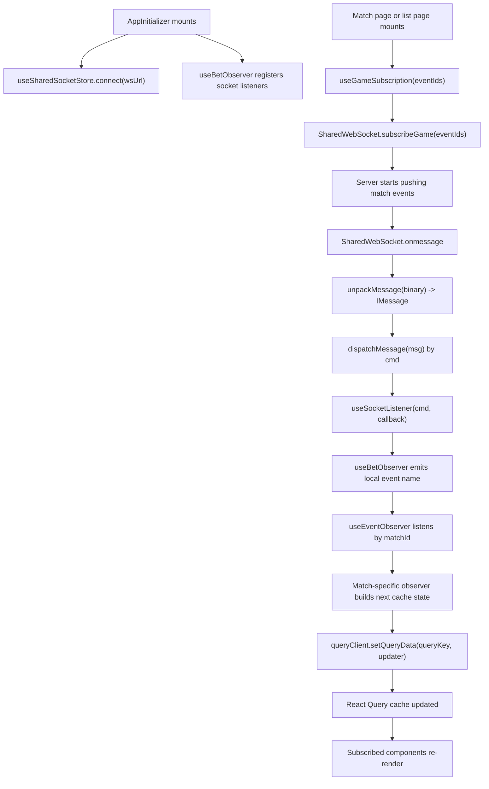
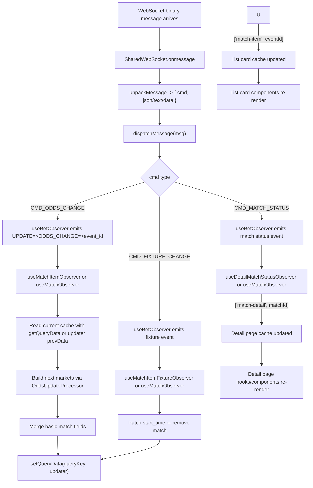

# WebSocket to Query Cache Flow

## Overview

This document explains how real-time WebSocket messages are routed into React Query cache entries in the match modules.

There are two main cache targets:

- `['match-detail', matchId]` for the match detail page
- `['match-item', eventId]` for a single match card inside list pages

The data flow is not "WebSocket updates the component directly". Instead, WebSocket messages are transformed into local events, then merged into React Query cache with `queryClient.setQueryData(...)`. Components re-render only because they subscribe to those cache entries.

## High-Level Flow



## Detailed Cache Write Flow



## Match Detail Cache Flow

The match detail page uses:

- query key: `['match-detail', matchId]`
- initial HTTP source: `GetMatchInterface({ event_id: matchId })`
- real-time cache patching: `useMatchItemObserver`, `useDetailMatchStatusObserver`, and `useMatchItemFixtureObserver`

The HTTP query does not simply overwrite cache. It first merges the fresh HTTP snapshot with any newer in-memory cache state:

```ts
const incoming = await GetMatchInterface({ event_id: matchId });
const prev = queryClient.getQueryData<MatchWithMarkets>(matchDetailKey);
return mergeMatchData(prev, incoming);
```

This matters because the cache may already contain fresher market lines from WebSocket updates.

### OddsChange on match detail

When an odds-change local event reaches `useMatchItemObserver`:

1. Read current cache with `queryClient.getQueryData(key)`
2. Build an `OddsUpdateProcessor` with:
   - the incoming payload
   - current home/away competitors
   - current `playersById`
3. Optionally collect missing player IDs
4. Compute next markets with `processor.generateMarkets(prevData.markets || [])`
5. Write the next cache value with:

```ts
queryClient.setQueryData(key, (prevData: MatchWithMarkets) => {
    return {
        ...updateMatchBasicInfo(prevData, payload),
        markets,
    };
});
```

This updates:

- match status
- score
- clock
- product
- markets

This only updates market line lock/suspension state.

### MatchStatus on match detail

`useDetailMatchStatusObserver` writes:

```ts
queryClient.setQueryData(['match-detail', matchId], (prevData) => {
    if (!prevData) return prevData;

    return {
        ...prevData,
        status: payload.status_code,
        match_status: payload.match_status_code,
    };
});
```

This updates only top-level status fields.

### Fixture on match detail

`useMatchItemFixtureObserver` writes:

```ts
queryClient.setQueryData(key, (prevData: MatchWithMarkets) => {
    return {
        ...prevData,
        start_time: payload.start_time,
    };
});
```

This updates only the match start time.

## Match List Card Cache Flow

Each list card uses:

- query key: `['match-item', eventId]`
- initial data source: the `match` prop passed from the list page
- real-time cache patching: `useMatchObserver`

The card seeds React Query with:

```ts
useQuery({
    queryKey,
    queryFn: () => transformMatchEvent(match),
    initialData: transformMatchEvent(match),
    enabled: false,
})
```

After that, WebSocket events mutate the same cache entry directly.

### OddsChange on match list item

`useMatchObserver` writes:

```ts
queryClient.setQueryData<MatchEvent>(queryKey, (prev) => {
    if (!prev) return prev;
    return updateEventWithOdds(prev, payload, playersById);
});
```

This updates:

- score
- status
- clock
- `markets`
- `popularMarkets`

### Fixture on match list item

```ts
queryClient.setQueryData<MatchEvent>(queryKey, (prev) => {
    if (!prev) return prev;
    return updateEventWithFixture(prev, payload);
});
```
### Match finished or cancelled on match list item

For certain events the cache entry is removed instead of patched:

```ts
queryClient.removeQueries({ queryKey });
```

This causes the list card to disappear because its cache becomes unavailable.

## How Market Merge Works

There are two related merge paths:

### 1. HTTP snapshot merge

`mergeMatchData(current, incoming)` is used when a fresh HTTP match detail snapshot arrives.

It does two things:

- choose top-level match fields using `timestamp`
- merge `markets` with `mergeMarkets(current.markets, incoming.markets)`

`mergeMarkets(...)`:

- merges duplicate market groups on both sides first
- builds a lookup from current cache: `groupId -> specifiers -> line`
- uses incoming markets as the structural base
- for overlapping lines, keeps whichever line has the newer `timestamp`

### 2. WebSocket incremental merge

`OddsUpdateProcessor.generateMarkets(markets)` is used for real-time odds updates.

It:

- classifies each incoming WS market into:
  - existing line updates
  - new lines for an existing group
  - completely new market groups
- merges outcomes by `outcome.id`
- appends new lines to existing groups
- optionally creates whole new groups for detail pages

This is more incremental than `mergeMatchData(...)`.

## Why `setQueryData` Is the Real Cache Write Step

The critical point is:

- WebSocket handlers do not update React components directly
- they do not refetch the HTTP query
- they only compute the next cache object and write it with `setQueryData(...)`

So the real-time behavior comes from this pattern:

1. read current cache
2. compute next state from payload + current cache
3. write next state back into the same query key
4. let subscribed components re-render from cache

## Summary

The WebSocket-to-cache path is:

1. subscribe the relevant match IDs
2. receive a binary WebSocket message
3. unpack it into a typed payload
4. emit a local match-specific event
5. let a match-specific observer compute the next state
6. write the next state into React Query with `setQueryData(...)`
7. let components re-render from that cache entry

This is the core pattern used by both the match detail page and the match list card flow.
